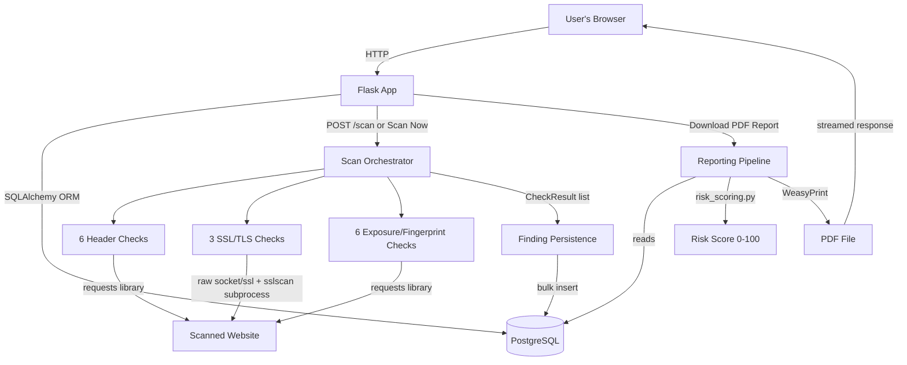

# Architecture

## System overview

Postura is a monolithic Flask application (no microservices, no
message queue) backed by PostgreSQL, with three logically distinct
layers:

1. **Web layer** — Flask routes/blueprints, Jinja2 templates, handles
   auth, CRUD for websites, and rendering results.
2. **Scanning engine** — a set of independent, composable "check"
   classes that each inspect one aspect of a target site (a header, a
   TLS property, an exposed file, etc.), orchestrated sequentially by
   a single entry point.
3. **Reporting pipeline** — aggregates a completed scan's findings
   into a structured report, generates a plain-language summary, and
   renders it to PDF.

## Component breakdown

### Data model
User (1) ──< Project (1) ──< Website (1) ──< Scan (1) ──< Finding

- **User** — an agency staff account (email/password, Flask-Login session).
- **Project** — a loose grouping of websites (currently auto-created
  per user; there's no dedicated project-management UI in the MVP).
- **Website** — a tracked target URL, with an optional display name.
- **Scan** — one execution of the check suite against a Website, with
  a status (`pending`/`running`/`completed`/`blocked`) and timestamps.
- **Finding** — one check's result within a Scan (severity, title,
  description, evidence, recommendation, pass/fail).

Deleting a Website cascades to delete its Scans and Findings (enforced
both at the database level via `ON DELETE CASCADE` and at the ORM
level).

### Scanning engine

Every check is a subclass of `BaseCheck` (`app/services/checks/base.py`)
with a single `run() -> CheckResult` method. This uniform interface is
what lets `scan_orchestrator.py` treat all 15 checks identically —
instantiate, call `.run()`, collect the result — regardless of what
each check actually does internally.

Checks fall into two architecturally distinct groups:

- **HTTP-based checks** (headers, exposure detection, fingerprinting)
  go through a shared `app/services/http_client.py`, which wraps
  Python's `requests` library with a default timeout, automatic
  retries, a capped redirect limit, a custom User-Agent, and per-host
  rate limiting (thread-safe, since exposure detection checks many
  paths concurrently).
- **TLS-based checks** (certificate validity) use raw `ssl`/`socket`
  connections directly — no HTTP request is involved, since certificate
  inspection happens during the TLS handshake itself, before any HTTP
  exchange. Protocol/cipher-strength checks specifically shell out to
  the external `sslscan` tool rather than using Python's `ssl` module
  directly, because the host's OpenSSL security policy prevents
  Python's `ssl` module from negotiating (and therefore detecting)
  genuinely weak/legacy protocols and ciphers — `sslscan` ships its
  own permissive OpenSSL build specifically for this kind of testing.
  See [security-considerations.md](security-considerations.md) for the
  full reasoning behind this design.

The orchestrator (`scan_orchestrator.py`) wraps every individual
check's execution in a try/except, so an unexpected exception in one
check cannot abort the rest of the scan — each check's own internal
error handling covers *expected* failures (a target being unreachable,
a TLS handshake failing), while the orchestrator's outer safety net
covers *unexpected* ones (bugs).

### Risk scoring

`app/services/risk_scoring.py` computes a single 0–100 score from a
scan's findings: starting at 100, deducting a fixed number of points
per failed finding based on severity, with a per-severity-tier cap so
many low-severity findings can't dominate the score the way one severe
finding does. The same function is used everywhere a score is shown —
the dashboard, the scan detail page, and PDF reports — so there is a
single source of truth for "what does this score mean."

### Reporting pipeline

`app/services/reporting/` builds a structured `ReportData` object from
a completed scan (findings grouped by severity, a deduplicated and
prioritized recommendations list, a plain-language executive summary),
renders it into a self-contained HTML document via Jinja2, then
converts that HTML to PDF via WeasyPrint. The HTML report template is
deliberately independent from the app's normal Bootstrap-based UI
(`base.html`) — it's a standalone document with embedded CSS, since
PDF rendering doesn't reliably support external stylesheets and a
print document has fundamentally different layout needs (page breaks,
running headers/footers) than a web page.

## Key design decisions

- **Synchronous scanning, not background jobs.** Scans run within the
  same request/response cycle that triggers them (with a loading
  spinner shown client-side). This keeps the MVP's architecture simple
  — no task queue, no worker processes — at the cost of a
  multi-second wait during a scan. Recurring/scheduled scans (Phase 2,
  via APScheduler) will need to revisit this.
- **PDF reports are generated on-demand, not stored.** Downloading a
  report regenerates it from the current database state each time,
  rather than persisting a rendered PDF file. Simpler, avoids storage
  management, at the cost of slightly slower repeated downloads.
- **SSRF protection via DNS resolution + IP classification**, not
  hostname string matching, since a malicious DNS name could otherwise
  resolve to a private/internal IP despite looking innocuous. See
  [security-considerations.md](security-considerations.md).

## Directory structure

See the [README](../README.md#project-structure) for the file/folder layout.

- **Scheduled scanning is single-instance by design.** The background
  scheduler (APScheduler's `BackgroundScheduler`, added in Sprint 6)
  runs inside the same process as the Flask app itself — there is no
  separate worker/queue service. If this app is ever deployed with
  multiple concurrent processes (e.g. a production WSGI server
  configured with multiple workers, or multiple container replicas
  behind a load balancer), only **one** of those processes should
  actually run scheduled scans — otherwise every process would
  independently pick up the same due websites and run duplicate scans
  simultaneously.

  This is enforced by two layered mechanisms (see
  `app/services/scheduling.py` and `app/__init__.py`):
  1. An explicit `SCHEDULER_ENABLED` environment variable, intended to
     be set to `true` on exactly one instance in a multi-process
     deployment.
  2. A Postgres session-level advisory lock
     (`pg_try_advisory_lock`), acquired automatically at startup as a
     fail-safe — even if `SCHEDULER_ENABLED` is misconfigured
     identically across multiple processes, only the first process to
     acquire the lock will actually start its scheduler; the rest
     detect the lock is held and skip starting theirs.

  **This does not currently support horizontal scaling of the
  scanning workload itself** — even with the locking correctly
  preventing duplicate scans, only one process's scheduler is ever
  actively running scheduled scans at a time, meaning scan throughput
  for scheduled jobs doesn't increase by adding more app instances.
  Scaling scheduled scan throughput would require a genuinely
  different architecture — e.g. a dedicated task queue (Celery, RQ)
  with multiple worker processes pulling from a shared queue, rather
  than each app instance running its own independent scheduler. This
  is a reasonable, explicit scope boundary for the current MVP, not an
  oversight.
